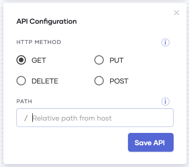

# Relative Path From Host

## Table of Contents
<!--ts-->

* [Introduction](#Introduction)

  * [1-Empty path](#1-Empty-path)
  * [2-Single path](#2-Single-path)
  * [3-Multiple path Strings](#3-Multiple-path-Strings) 
  * [4-Path Parameters](#4-Path-Parameters)

<!--te-->

## Introduction 

When creating a Choreo application with an API trigger, you are required to enter a relative path from the host in the **Path** field of the **API Configuration** form. This is the path used by the API to trigger the Choreo application as well as to pass path parameters to your application.

e.g., Create a Choreo application named `sample` with an API trigger. 

Once you deploy the application, you receive a hostname as follows.

`https://sample-<USERNAME>.choreoapps.dev`

The URL that you need to invoke to trigger the application changes based on the relative path from the host that you specify in the **Path** field of the API configuration.

### 1-Empty path

If you do not specify a relative path from host, invoking the hostname triggers the Choreo application.

e.g.,
**Path**: Not specified
**Trigger URL**: https://sample-username.choreoapps.dev

### 2-Single path

If you provide a single path in this field, you need to append it to the hostname to invoke your application.

e.g.,
**Path**: /path1
**Trigger URL**: https://sample-username.choreoapps.dev/path1

### 3-Multiple path Strings 

You could also provide multiple paths for this field. If you do so, you need to append them to the hostname to invoke your application.

e.g.,
**Path**: /path1/path2/path3
**Trigger URL**: https://sample-username.choreoapps.dev/path1/path2/path3

### 4-Path Parameters

If you specify a path parameter, it could be read from within your Choreo application. This allows you to read values provided within the path 

Format: [<data type> <parameter name>]

e.g.,
**Path**: /[int date]/[string day]
**Trigger URL**: https://sample-username.choreoapps.dev/8/monday

This allows you to read the value of date (e.g., '8') and the day (e.g., `Monday` from within your Choreo application.

 
