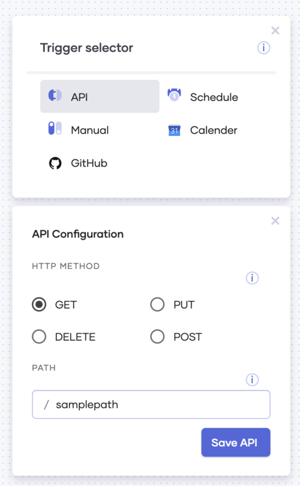
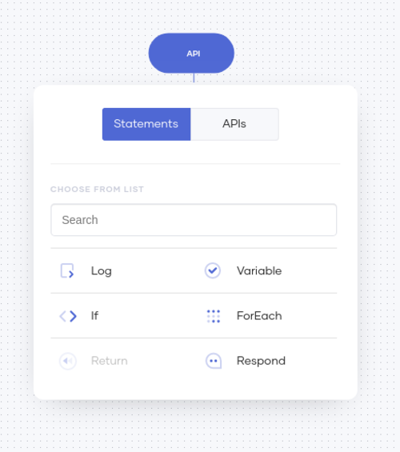
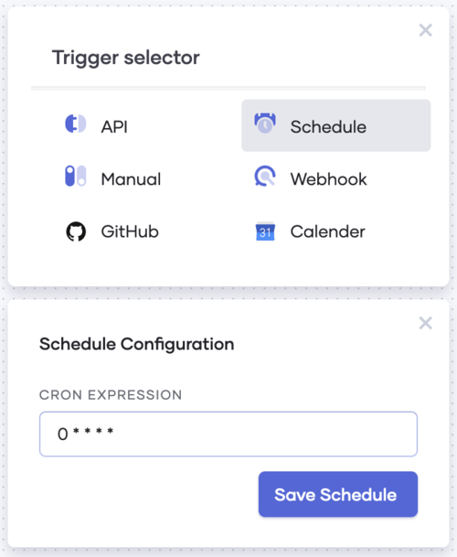
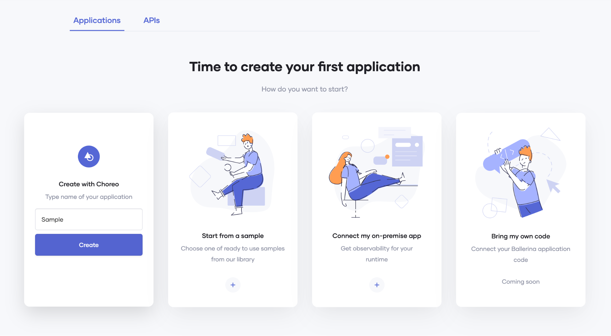
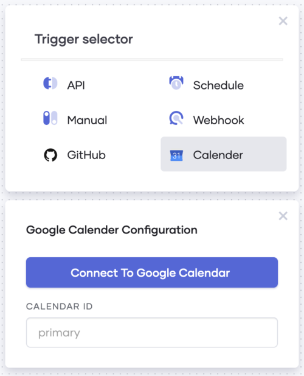
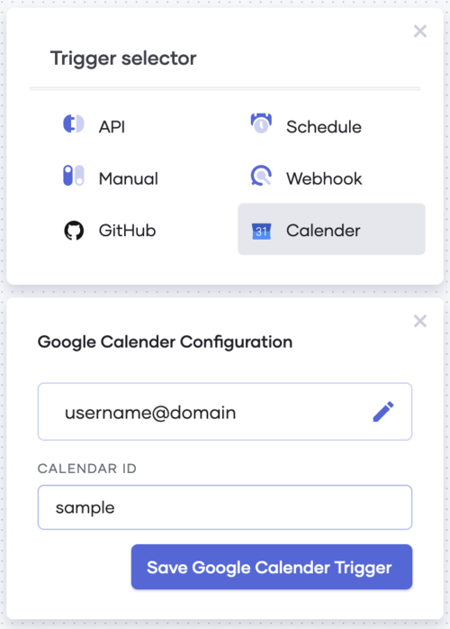
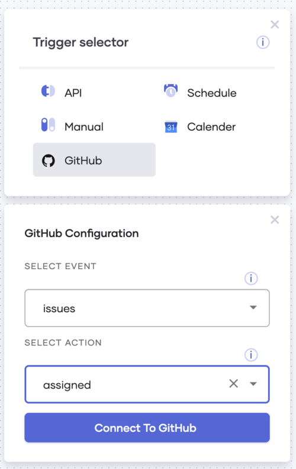
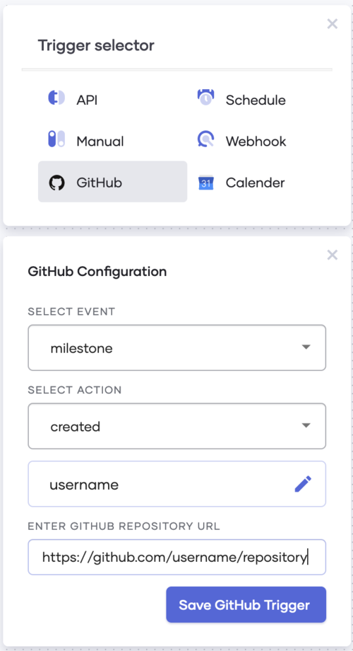

# Choreo Application Triggers

## Table of contents
<!--ts-->

* [Introduction](#Introduction)
* [1-API](#1-API)
  * [Creating an API trigger](#Creating-an-API-trigger)
* [2-Manual](#2-Manual)
  * [Creating a Manual trigger](#Creating-a-Manual-trigger)
* [3-Schedule](#3-Schedule)
  * [Creating a Schedule trigger](#Creating-a-Schedule-trigger)
* [4-Calendar](#4-Calendar)
  * [Creating a Calendar trigger](#Creating-a-Calendar-trigger)
* [5-GitHub](#5-GitHub)
  * [Creating a GitHub trigger](#Creating-a-GitHub-trigger)

<!--te-->

## Introduction 

A trigger is an event or an action that causes a Choreo application to start executing.

Consider the following example scenario. 

*Suppose you want to be notified when a new GitHub issue is created in your project repository. You can develop a Choreo application with ease to do so. This application will start running when a new GitHub issue is created. Therefore “GitHub issue creation” becomes the trigger for your application.*

Choreo applications support the following list of triggers

1-API                                  
2-Manual   
3-Schedule  
4-Calendar  
5-Github  

Once a Choreo application is created, you will be prompted to select the trigger.  

## 1-API

API trigger allows you to create a Choreo application and expose it as an API endpoint.

Once you create an application with this trigger and deploy it, Choreo will expose the API endpoint. Then the application is triggered when a request is sent to this API endpoint.  

### Creating an API trigger 

1- Select “API” from the list of triggers after creating a Choreo application.

2- Select the desired HTTP method, provide a relative path from host and save the configuration

3- You can now start developing your application by adding statement elements or API elements using the low code editing capabilities of Choreo.

## 2-Manual 

### Creating a Manual trigger 

Manual trigger allows you to create an application that you can trigger manually by clicking the run button.

1- Select Manual from the list of triggers

## 3-Schedule

A Schedule trigger lets you trigger your Choreo application according to a given schedule. Hence it is used when you need your application run to be triggered based on time. The schedule is defined in the form of a cron expression. 

A cron expression is a string containing subfields separated by white spaces . Each special character (*) represents Seconds, Minutes, Hours, Date, Month, Day, and Year respectively.

### Creating a Schedule trigger

1- Select Schedule from the list of triggers

2-Enter a Cron expression for the schedule and save the configuration

## 4-Calendar 

Calendar trigger lets you trigger a Choreo application based on events in a Google Calendar.

### Creating a Calendar trigger 

1- Create a Choreo Application

2- Select Calendar from the list of triggers

3- If your Choreo account has not yet been connected to Google calendar you will see the following in the Calendar trigger configuration. Click `Connect to Google Calendar` and follow the on screen instructions to proceed.

4- Once the Google Calendar is connected to your Choreo account, your email address will be displayed. Specify the calendar you would like to associate with the trigger by entering the calendar ID and save the configuration.

## 5-GitHub 

GitHub trigger lets you trigger Choreo applications based on GitHub events and actions.

GitHub trigger supports a number of events and each such event supports a number of actions. A combination of an event and an action triggers the Choreo application. 

The supported list of events and associated actions are as follows

| Event                       | Action                 | Choreo application triggered when...     |
|-----------------------------|------------------------|------------------------------------------|
| issue_comment               | created                | Comment is added to an issue             |
|                             | edited                 | Comment on an issue is edited            |
|                             | deleted                | Comment on an issue is deleted           |
| issues                      | assigned               | Issue is assigned to a user              |
|                             | unassigned             | Issue is unassigned from a user          |
|                             | labeled               | Label is added to an issue               |
|                             | unlabeled             | Label is removed from an issue           |
|                             | opened                 | Issue is opened                          |
|                             | edited                 | Issue is edited                          |
|                             | milestoned             | Milestone is added to an issue           |
|                             | demilestoned           | Milestone is removed from an issue       |
|                             | closed                 | Issue is closed                          |
|                             | reopened               | Issue is reopened                        |
| label                       | created                | Label is created                         |
|                             | edited                 | Label is edited                          |
|                             | deleted                | Label is deleted                         |
| milestone                   | created                | Milestone is created                     |
|                             | closed                 | Milestone is closed                      |
|                             | opened                 | Milestone is opened                      |
|                             | edited                 | Milestone is edited                      |
|                             | deleted                | Milestone is deleted                     |
| pull_request                | assigned               | Pull request is assigned to a user       |
|                             | unassigned             | Pull request is unassigned from a user   |
|                             | review_requested       | User is requested to review pull request |
|                             | review_request_removed |                                          |
|                             | labeled                | Label is added to a pull request         |
|                             | unlabeled              | Label is removed from pull request       |
|                             | opened                 | Pull request is opened                   |
|                             | edited                 | Pull request is edited                   |
|                             | closed                 | Pull request is closed                   |
|                             | reopened               | Pull request is reopened                 |
| pull_request_review         | submitted              | Pull request review is submitted         |
|                             | edited                 | Pull request review is edited            |
|                             | dismissed              | Pull request review is dismissed         |
| pull_request_review_comment | created                | Pull request review comment is created   |
|                             | edited                 | Pull request review comment is edited    |
|                             | deleted                | Pull request review comment is deleted

### Creating a GitHub trigger

1- Select GitHub from the list of triggers

2- Select the GitHub event and action. If no GitHub account has been linked, `Connect to GitHub` button is displayed. Click it and follow the onscreen steps to connect to GitHub.

3- Once the GitHub account is linked, it will be displayed in the GitHub trigger configuration. Provide the URL of the repository which would trigger the Choreo application and Save the configuration.

